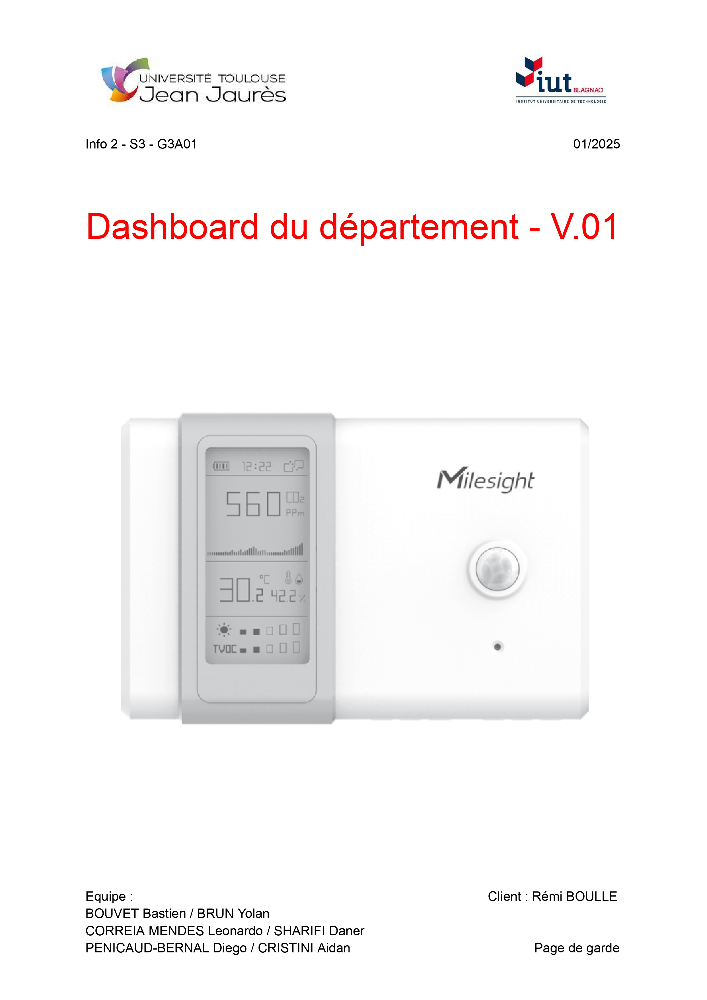
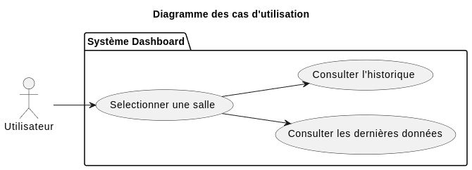
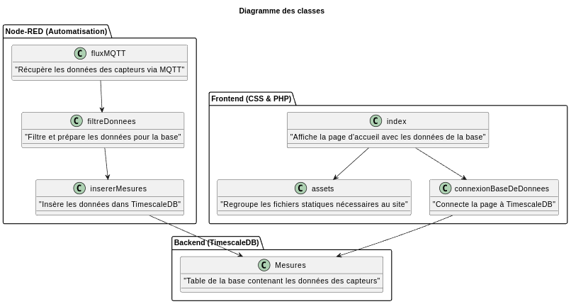
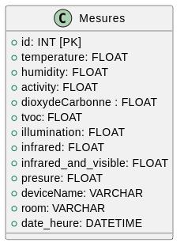

:toc: macro

[alt="Dashboard du Département", align="center", width=100%]

= Documentation Technique sprint n°1 SAE-ALT-S3-Dev-24-25-Dashboard_du_departement

=== Sommaire
toc::[]

== Equipe 2024 - 2025

- link:https://github.com/boubast[BOUVET Bastien] -- Scrum Master / Développeur
- link:https://github.com/YolanBrun[BRUN Yolan] --  Rédacteur / Développeur
- link:https://github.com/leonardo-correiamendes[CORREIA MENDES Leonardo] -- Chef de projet / Développeur
- link:https://github.com/Diego-PB[PENICAUD-BERNAL Diego] -- Responsable base de donnée / Développeur
- link:https://github.com/DanerSharifi-FR[SHARIFI Daner] -- Responsable serveur web / Développeur
- link:https://github.com/Smogita[CRISTINI Aidan] -- Git Master / Développeur

== Présentation du projet

=== *Contexte Général*
Ce projet vise à exploiter les données des capteurs AM107 situés dans les salles du 1er étage du département d’informatique. Ces capteurs collectent des données telles que la présence (valeur d’activité), la luminosité (en lux) et le niveau de CO2, diffusées via un flux MQTT.

L'objectif principal est de fournir un outil centralisé pour visualiser et analyser ces données à des fins de gestion et d'optimisation de l’utilisation des salles.

=== Objectif du Projet
Le projet consiste à développer une interface web qui permet :

* De consulter les données en temps réel des capteurs.
* De stocker ces données dans une base de données TimescaleDB pour disposer d'un historique.
* De visualiser les données sur un plan SVG interactif des salles du bâtiment.
* De réaliser des statistiques pour analyser l'occupation des salles.

=== Technologies Utilisées

* **Docker** : Conteneurisation de l’application et de ses services pour une portabilité et une isolation facile.
* **Node-RED** : Intégration des flux MQTT pour l’acquisition et le traitement des données des capteurs.
* **TimescaleDB** : Base de données relationnelle pour le stockage des données temporelles.
* **Nginx** : Serveur web pour l’interface utilisateur.
* **PHP** : Gestion des requêtes backend pour interagir avec la base de données.
* **HTML/CSS/JavaScript** : Construction de l’interface utilisateur incluant le plan SVG interactif.

== Cas d'Utilisation Global

* Consulter les Mesures des Capteurs

** Visualiser les données des capteurs (température, luminosité, CO2, etc.) sur le site web.

** Explorer les données en temps réel pour chaque salle via le plan interactif.

* Accéder à l’Historique des Mesures

** Consulter l’historique des données des capteurs stockées dans la base TimescaleDB.

** Analyser les évolutions temporelles pour obtenir des statistiques sur l’occupation des salles.

* Analyser les Statistiques d’Occupation

** Générer des graphiques et rapports basés sur les données collectées.

** Identifier les tendances et optimiser l’utilisation des espaces.

== Diagrammes des cas d'utilisation

Celui-ci présente le diagramme des cas d’utilisation de notre projet :

== Diagrammes des classes 

Celui-ci présente le diagramme des classes de notre projet :

=== Explication des classes

Comme le montre le diagramme des classes, notre projet est structuré autour de trois grandes composantes : le frontend (CSS et PHP), l’automatisation via Node-RED, et la gestion des données dans une base TimescaleDB.

==== Frontend (CSS & PHP)

* `index` :  
  Cette classe représente la page d'accueil du site web. Elle permet aux utilisateurs de consulter les données stockées dans la base TimescaleDB et offre une interface intuitive pour naviguer dans l'application.

* `assets` :  
  Ce regroupement contient tous les fichiers statiques nécessaires à l'interface, notamment les fichiers CSS pour le style et les fichiers JavaScript pour les interactions dynamiques.

==== Node-RED (Automatisation)

* `fluxMQTT` :  
  Ce composant Node-RED est chargé de la récupération des données des capteurs via le protocole MQTT, permettant une mise à jour en temps réel ainsi que l'insertion des données dans la base de donnée TimescaleDB.

==== Backend (TimescaleDB)

==== Structure de la base de données :

[]

* `Mesures` :  
  Cette table de la base de données stocke toutes les données des capteurs, telles que la température, l'humidité, la luminosité et d'autres mesures pertinentes. Elle constitue le cœur de la gestion des données dans l'application.

Cette structure modulaire permet de répartir efficacement les responsabilités : 
le frontend gère l'affichage et l'interaction utilisateur, Node-RED automatise le traitement des données en temps réel, et la base TimescaleDB assure leur stockage de manière fiable et évolutive.

== Fonctionnalités

=== Utilisation de Docker

Docker permet de conteneuriser les différents services du projet (Node-RED, TimescaleDB, Nginx, et PHP) pour une déploiement rapide et une gestion simplifiée. Chaque composant fonctionne dans un conteneur isolé, garantissant ainsi la stabilité et la portabilité de l’application.

=== Présentation des Fichiers Clés

==== Fichiers de lancement

* docker-compose.yml : Coordonne le déploiement des services dans des conteneurs Docker.

* docker_control.sh : Script bash interactif permettant de démarrer ou d’arrêter tous les conteneurs avec des commandes simples.

==== Scripts JavaScript

* Fichiers JavaScript situés dans le répertoire WEB/assets/js :

** final.js : Contient les scripts principaux pour l’interaction utilisateur.

** theme.js : Gère les thèmes et les éléments visuels de l’interface.

** widgets/*.js : Scripts pour les graphiques et composants interactifs.

==== Pages Web

* WEB/index.php : Page d’accueil dynamique qui affiche les données des capteurs et le plan SVG interactif.

* WEB/room.php : Page dédiée à l’affichage d’informations d’une salle spécifique.

==== Styles

Fichiers CSS situés dans WEB/assets/css :

* style.css : Contient les styles globaux de l’application.
