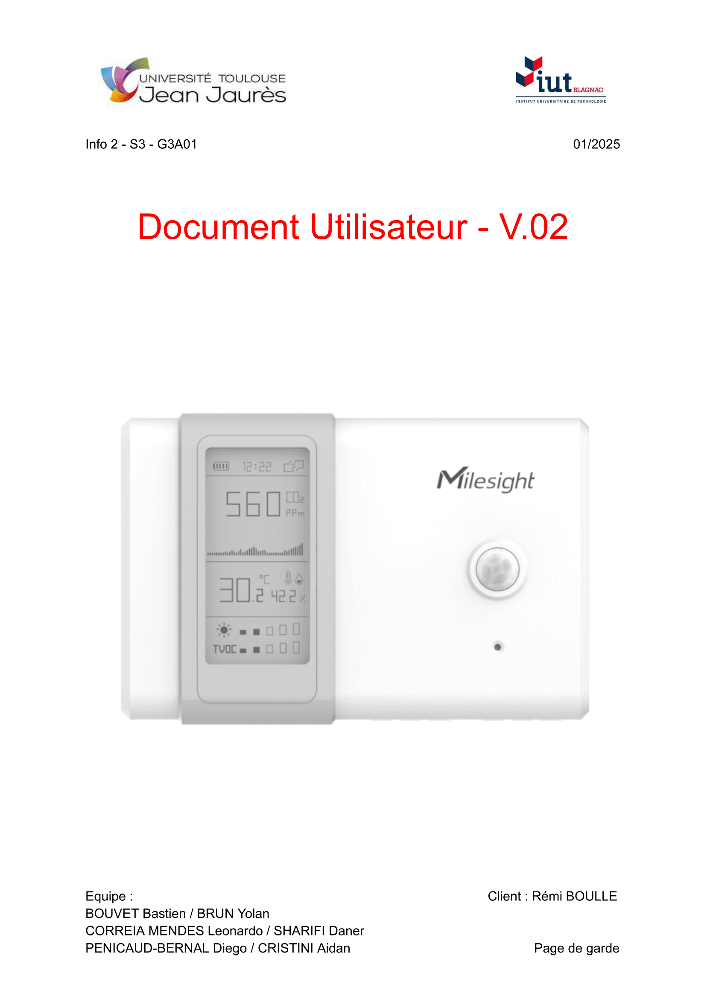

:toc: macro

= Documentation Utilisateur sprint n°2 SAE-ALT-S3-Dev-24-25-Dashboard_du_departement

== Sommaire
toc::[]

== Equipe 2024 - 2025

- link:https://github.com/boubast[BOUVET Bastien] -- Scrum Master / Développeur
- link:https://github.com/YolanBrun[BRUN Yolan] --  Rédacteur / Développeur
- link:https://github.com/leonardo-correiamendes[CORREIA MENDES Leonardo] -- Chef de projet / Développeur
- link:https://github.com/Diego-PB[PENICAUD-BERNAL Diego] -- Responsable base de donnée / Développeur
- link:https://github.com/DanerSharifi-FR[SHARIFI Daner] -- Responsable serveur web / Développeur
- link:https://github.com/Smogita[CRISTINI Aidan] -- Git Master / Développeur

== Présentation du projet

=== *Contexte Général*
Ce projet vise à exploiter les données des capteurs AM107 situés dans les salles du 1er étage du département d’informatique. Ces capteurs collectent des données telles que la présence (valeur d’activité), la luminosité (en lux) et le niveau de CO2, diffusées via un flux MQTT.

L'objectif principal est de fournir un outil centralisé pour visualiser et analyser ces données à des fins de gestion et d'optimisation de l’utilisation des salles.

Les principaux utilisateurs de cette solution seront des **analystes de données**, qui pourront exploiter les informations présentées pour mieux comprendre l'utilisation des espaces et optimiser leur gestion.

=== Objectif du Projet
Le projet consiste à développer une interface web qui permet :

* De consulter les données en temps réel des capteurs.
* De stocker ces données dans une base de données TimescaleDB pour disposer d'un historique.
* De visualiser les données sur un plan SVG interactif des salles du bâtiment.
* De réaliser des statistiques pour analyser l'occupation des salles.

=== Installation

Le guide d'installation est disponible, voici le lien :
link:../guide_demarrage.md[Guide d'installation]

== Fonctionnalités

Le site permet de visualiser la carte du 1er étage du bâtiment, incluant les salles équipées de capteurs AM107. L'interface offre les fonctionnalités suivantes :

- **Visualisation des données des capteurs** : En cliquant sur une salle sur le plan SVG, l'utilisateur peut consulter les dernières données relevées par les capteurs de la salle (température, humidité, activité, etc.).
- **Affichage de l'historique** : Accès à l'historique des mesures enregistrées dans la base de données TimescaleDB pour chaque salle.
- **Mise à jour automatique** : Les données des capteurs sont mises à jour en temps réel dans la base de données via les flux MQTT traités par Node-RED.

L'objectif principal est de fournir une interface claire et fonctionnelle permettant d'analyser les données des capteurs et de suivre l'occupation des salles à travers un historique visuel.

== Utilisation de l'interface Web

== Scénarios d'usage typiques

