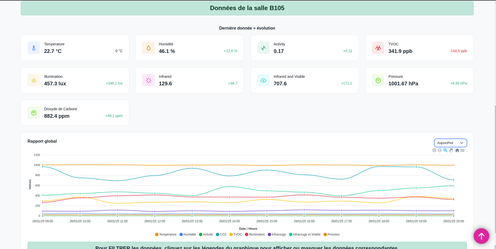

:toc: macro

= Documentation Utilisateur sprint n°3 SAE-ALT-S3-Dev-24-25-Dashboard_du_departement

image::../../images/Document_util3.png[align="center", width=100%]

== Sommaire
toc::[]

== Equipe 2024 - 2025

- link:https://github.com/boubast[BOUVET Bastien] -- Scrum Master / Développeur
- link:https://github.com/YolanBrun[BRUN Yolan] --  Rédacteur / Développeur
- link:https://github.com/leonardo-correiamendes[CORREIA MENDES Leonardo] -- Chef de projet / Développeur
- link:https://github.com/Diego-PB[PENICAUD-BERNAL Diego] -- Responsable base de donnée / Développeur
- link:https://github.com/DanerSharifi-FR[SHARIFI Daner] -- Responsable serveur web / Développeur
- link:https://github.com/Smogita[CRISTINI Aidan] -- Git Master / Développeur

== Présentation du projet

=== *Contexte Général*
Ce projet vise à exploiter les données des capteurs AM107 situés dans les salles du 1er étage du département d’informatique. Ces capteurs collectent des données telles que la présence (valeur d’activité), la luminosité (en lux) et le niveau de CO2, diffusées via un flux MQTT.

L'objectif principal est de fournir un outil centralisé pour visualiser et analyser ces données à des fins de gestion et d'optimisation de l’utilisation des salles.

Les principaux utilisateurs de cette solution seront des **analystes de données**, qui pourront exploiter les informations présentées pour mieux comprendre l'utilisation des espaces et optimiser leur gestion.

=== Objectif du Projet
Le projet consiste à développer une interface web qui permet :

* De consulter les données en temps réel des capteurs.
* De stocker ces données dans une base de données TimescaleDB pour disposer d'un historique.
* De visualiser les données sur un plan SVG interactif des salles du bâtiment.
* De réaliser des statistiques pour analyser l'occupation des salles.

=== Installation

Le guide d'installation est disponible, voici le lien :
link:../guide_demarrage.md[Guide d'installation]

== Fonctionnalités

Le site permet de visualiser la carte du 1er étage du bâtiment, incluant les salles équipées de capteurs AM107. L'interface offre les fonctionnalités suivantes :

- **Visualisation des données des capteurs** : En cliquant sur une salle sur le plan SVG, l'utilisateur peut consulter les dernières données relevées par les capteurs de la salle (température, humidité, activité, etc.).
- **Affichage de l'historique** : Accès à l'historique des mesures enregistrées dans la base de données TimescaleDB pour chaque salle.
- **Mise à jour automatique** : Les données des capteurs sont mises à jour en temps réel dans la base de données via les flux MQTT traités par Node-RED.

L'objectif principal est de fournir une interface claire et fonctionnelle permettant d'analyser les données des capteurs et de suivre l'occupation des salles à travers un historique visuel.

== Utilisation de l'interface Web

=== Navigation sur la carte

Arrivé sur le site, l'utilisateur est accueilli par une carte du 1er étage du bâtiment.
En **cliquant** sur une salle, l'utilisateur peut consulter les données des capteurs de la salle.

Une fois une fois une salle sélectionnée, l'utilisateur accède à une page dédiée à la salle, affichant les données des capteurs et un graphique de l'historique des mesures.

Il est possible de retourner a la selection de salle en cliquant sur le bouton **Retour au tableau de bord** en haut a droite.

=== Manipulation des données

Il est possible d'interagit avec le graphique pour modifier l'affichage avec le menu en haut a droite du graphique.

Le menu déroulant permet de choisir les données par jour ou semaine.

Une liste de bouton est disponible pour modifier l'affichage du graphique.

Liste des options disponibles :

- **Zoom** : Permet de zoomer sur le graphique.

- **Dézoomer** : Permet de dézoomer sur le graphique.

- **Loupe** : Permet séléctionner une zone du graphique pour zoomer.

- **Main** : Permet de déplacer le graphique de gauche a droite.

- **Maison** : Permet de réinitialiser le graphique.

- **Menu** : Permet d'exporter le graphique en image.

== Scénarios d'usage typiques

=== Scénario : Analyse de l'occupation d'une salle pour optimiser les réservations

Un analyste de données souhaite vérifier l'utilisation d'une salle spécifique (par exemple, la salle B105) au cours de la dernière semaine pour optimiser les réservations futures.

**Étapes :**

1. L'utilisateur ouvre le site web et est accueilli par la carte interactive du 1er étage du bâtiment.  

2. L'analyste clique sur la salle B105. Une page dédiée à la salle s'ouvre, affichant :  
   - Les dernières données en temps réel des capteurs (présence, luminosité, niveau de CO2, etc.).  
   - Un graphique interactif montrant l'historique des données de la salle.  

3. L'utilisateur utilise les options du graphique pour visualiser les données d'occupation sur les 7 derniers jours :
   - En sélectionnant le mode "Weekly" dans le menu déroulant.  
   - En zoomant sur des périodes spécifiques pour analyser des pics d'activité.  

4. Après avoir analysé les données, l'utilisateur identifie des périodes de faible occupation et propose des ajustements dans le planning des réservations.  

**Résultat attendu :**
L'analyste peut facilement visualiser et analyser les données d'occupation pour optimiser la gestion des espaces du département.

**Bénéfices :**
- Visualisation rapide des périodes de faible ou forte occupation.  
- Meilleure gestion des salles et des ressources grâce à des données concrètes.  
- Réduction des conflits ou des inefficacités dans l’utilisation des salles.

