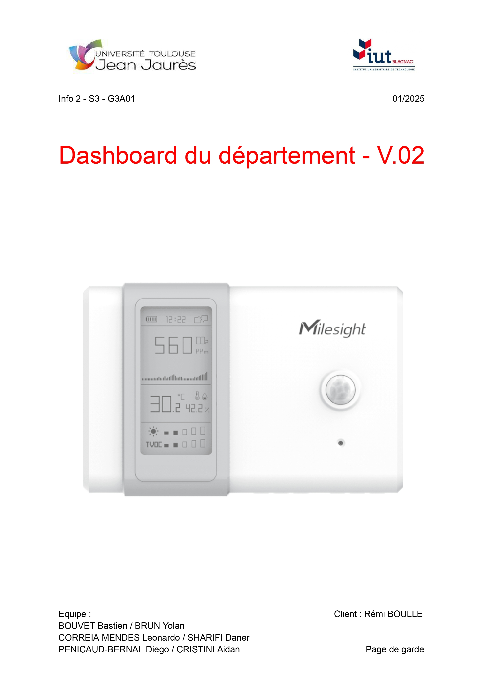

# **Compte rendu** : 20/01/25

1. **Récapitulatif du travail réalisé, des erreurs commises et des ressentis personnels**

Pour ce qui est des travaux réalisés

- Intégration des graphiques pour afficher les données historiques (jour, semaine).
- Amélioration de l’interface utilisateur pour faciliter la navigation.
- Résolution du problème de saturation de la file d'attente dans Node-RED.
- Finalisation de l’export des données (PNG, CSV, SVG).

Ressenti personnel :

Diego
: Semaine agréable, l’équipe progresse bien ensemble, et l’ambiance reste motivante.

Aidan
: Les choses avancent correctement, chacun est concentré et efficace. Les retours des professeurs sont très utiles.

Leonardo
: Le groupe fonctionne bien, les tâches avancent dans une bonne dynamique.

Bastien
: Très bonne entente dans le groupe, les échanges sont constructifs et renforcent la collaboration.

Daner
: Semaine productive, tout le monde est impliqué et les objectifs avancent comme prévu.

Yolan
: Bonne coordination dans l’équipe, les efforts communs sont efficaces et bien organisés.

1. **Association du travail restant à chacun** 
- Daner & Yolan : Travail sur l’interface web, finalisation des détails.
- Diego & Aidan : Mise à jour et finalisation des différentes documentations du projet.
- Leonardo & Bastien : Tests et vérifications des fonctionnalités, correction des bugs.
1. **Discussion autour des problématiques principales**
   Pas de problématiques majeures à signaler.
   
2. **Tour de table**
    - Pas de sujet a faire remonter
